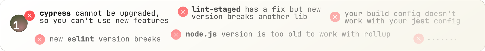
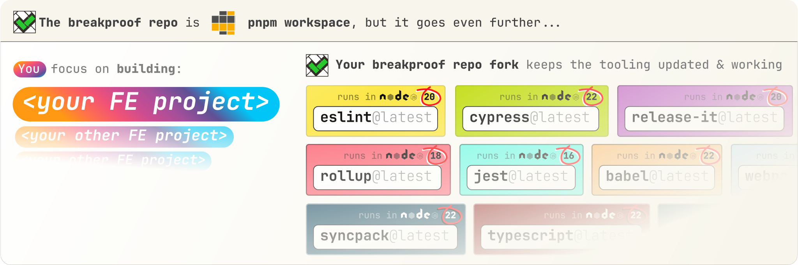
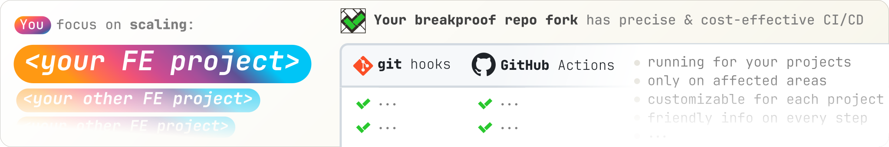

<div align="center">

<picture></picture>


<a name="breakproof-nav"></a>

🎯 [What problems does it solve?](#the-problems-it-solves) — 💡
[How is it done?](#how-it-works) — 🚀
[Getting started](#getting-started-with-your-breakproof-repo) — 🏆
[List of Best Practices](#best-practices-list)

⚙️ [Tools & Configuration](#tools-list) — ⚖️
[Conventions](#conventions-and-core-principles) — 📋️ [What's next](#whats-next)

<sub>[How can tools use different node.js?](#but-how-multiple-nodejs)</sub>

</div>

<div align="center">

[](https://github.com/YotpoLtd/breakproof-base-monorepo/fork)
[](https://codespaces.new/YotpoLtd/breakproof-base-monorepo)

</div>

# The Breakproof monorepo base: **TLDR**

The breakproof base monorepo offers **a new home 🏠** for **your frontend
projects** (_for both enterprise or pet projects_). It's designed to let you
focus entirely on them, to make upgrading them easier and to ensure all
processes around them are always up to date, optimized & following best
practices, all of that **without breaking your code or _breaking-the-bank_**.

Forking 🔀 the breakproof base monorepo creates **your new breakproof home** 🏠,
where you **import your existing** projects or **create new** ones. ⚡
**_Immediately_** those projects get a ton of **working** processes like
**optimized** CI/CD, **meticulous** code checks, **automatic** `npm` releases,
**precise** code-editor integration, etc. **_Because_** you forked the repo, you
keep receiving updates for those processes simply via `git pull`.

All of that 🔼 is implemented by making **industry-standard tools 🏆** work
together, **_NOT_** introducing "_yet-another-abstraction_" and **_NOT_**
requiring specific project tech stack.

<a name="the-problems-it-solves"></a>

# 🎯 What problems does `Breakproof Base Repo` fork solve?

<picture></picture>

🛠️ You want to **focus building your project**, not waste time in upgrading the
tooling around it or making different tools for code checks, testing, build &
release behave well together or with your code editor, **_BUT at the same
time_** you want to get the bug fixes and performance improvements from latest
versions of all tools 🤔 ([solution in next section](#how-it-works)).

<p> </p>

<picture></picture>

👨‍🔧 It's hard to create a well-optimized, precise & cost-effective CI/CD that
doesn't break with scale and informs developers what is going to happen without
noise. You want someone else to create & maintain 90% of CD/CD processes,
without requiring your projects to have specific tech stack 🤔
([solution in next section](#how-it-works)).

<p> </p>

<picture></picture>

🗄 You **cannot regularly stop** development until you upgrade everything
everywhere, you want to do it **piece by piece in isolation** 🤔
([solution in next section](#how-it-works)).

<p> </p>

<picture></picture>

🕊 You want to improve your codebase but cannot fix all problems at once. You
need to be **tolerant of existing problems** but **forbid new problematic code**
🤔 ([solution in next section](#how-it-works)).

<p> </p>

<picture></picture>

🥴 You are **tired of learning new configuration formats** with each new
repo-management tool that comes out and then **hitting its customization
limits**. You want to **directly deal with the tools** used but still rely on
**sensible default configuration** you can extend 🤔
([solution in next section](#how-it-works)).

<p> </p>

<picture></picture>

🏆 You want to use industry-standard best practices without having to design the
entire process from scratch, **_BUT at the same time_** be free to swap
individual tools without having to redo the entire system 🤔
([solution in next section](#how-it-works)).

<p> </p>

[⬆️ Back to top nav ⬆️](#breakproof-nav)

<p> </p>

<a name="how-it-works"></a>

# 💡 How does `Breakproof Base Repo` solve those problems?

<picture></picture>

- The repo is a `pnpm` workspace — _a.k.a._ monorepo managed only using `pnpm`
  without any abstraction on top of it. This, by itself, lets you isolate one
  project from another by making each a separate package. The breakproof repo
  goes **_a step further_**.

- When using the breakproof repo, your projects are isolated from the tools they
  use. This is achieved by installing the tools in a separate package instead of
  the same package as your project. In fact each different tool is installed in
  its own individual package. This allows us to leverage an ability of `pnpm` to
  specify a different `node.js` for each package. Essentially you get an
  isolated pair of `<tool> + <node.js>`, e.g. `eslint + node22` which lets you
  execute `eslint` using `node22` from any place in the repo with command
  similar to:
  `pnpm --filter=<PACKAGE NAME THAT INSTALLS TOOL IN IT> run <TOOL NAME>`

- The breakproof repo comes with several tool packages already in it, each
  installs one industry-standard tool like `eslint` or `TypeScript` or `rollup`
  or `jest`, …[_( full list below ⬇️ )_](#tools-list). Additionally, each of
  those packages include **detailed base configuration** for the specific tool
  that your projects can extend. 🔄 Each individual tool can be swapped with
  another as long as it does it's job.
  _([role of each tool is listed below ⬇️](#tools-list)_

- On many occasions the base configuration is tweaked so it accounts for
  limitation of another tool, thus making them behave well together. Not all
  tools accept all their settings through a config file, some require CLI
  arguments. For those occasions, each package that contains an isolated tool
  defines a command in the "script" section of its `package.json` to act as a
  shortcut. This shortcut can be executed from anywhere running:
  `pnpm --filter=<PACKAGE NAME THAT INSTALLS TOOL IN IT> run <SHORTCUT NAME>`

- The above 🔼 means that suddenly you can upgrade one tool in complete
  isolation from the rest & your project, even if the newer version requires a
  newer `node.js` version. This will not affect other packages. It also means
  your code can use whatever `node.js` version you need while some useful tool
  is "stuck" in the past without dragging you down

<p> </p>

<picture></picture>

- The CI/CD process is implemented as GitHub actions/workflows. Because it knows
  the repo uses `pnpm`, we can target only a subset of the packages inside it
  when running tasks. For example, if a PR changes only your project the CI/CD
  will run test & linting checks **only for your project**. It will also run
  them in parallel, and install only the dependencies that your project needs
  which are cached, so subsequent runs with the same dependencies don't waste
  time re-downloading them.

- The only requirement from your projects to participate in the CI/CD is to
  define properties in the `"scripts"` section of their `package.json` with
  specific names. You can run whatever command you like there, but probably you
  will run some of the isolated tools as shown above. For example, if you want
  your project tested in GitHub PRs, the project must define a `lint:github-pr`
  script with value of `pnpm --filter='@repo/jest-base-isolated' run jest` where
  `@repo/jest-base-isolated` is just the name of the package that isolates
  `jest`. The convention for the names of those scripts is as straightforward as
  possible, so you need `build` for building, `release` for `npm` releases, etc.

- Because the CI/CD is a GitHub action, it easily posts comments on your PRs
  with useful info about the upcoming releases when PR is merged, or summary of
  code problems found in the changed packages. The CI/CD will also run specific
  checks for repository [conventions](#conventions-and-core-principles) like
  making sure every `package.json` explicitly defines desired `node.js` version
  to use. The breakproof repo even implements
  [GitHub job summary](https://github.blog/news-insights/product-news/supercharging-github-actions-with-job-summaries/)
  which allows for a friendly way to overview the progress of the running
  workflow without the noise of going through logs.

- You can implement your custom CI/CD bits like running deployment as just
  another GitHub workflow, **_BUT_** with the benefit that your workflow can
  receive extra inputs — the list of packages that have been changed or the list
  of packages that will be automatically released to `npm`. You can then use
  that information to only trigger logic in certain cases.

<picture></picture>

- To allow you to work on projects that have some code problems **_BUT at the
  same time_** stop new problems from popping up, the breakproof repo has
  created a few `node.js` scripts inspired by `esplint` that basically
  "snapshots"/"remembers" what kind of problems each of your files have and how
  many occurrences per problem type there are. This allows you to ignore the
  existing ones but error out if the number of problems increase. This same
  ability of "remembering existing problems" is useful when tools are upgraded
  or their configuration changes. At this point they can become stricter or
  change the way they detect problems. To unblock the upgrade without investing
  immediately investing time you can snapshot the new results and continue with
  your day.

<p> </p>

[⬆️ Back to top nav ⬆️](#breakproof-nav)

<p> </p>

<a name="getting-started-with-your-breakproof-repo"></a>

# 🚀 Get started with _your_ `breakproof` repo

1. 🔀 **Fork this repo.**

2. 🎛️ Initialize your fork with your preferences:

   ```shell
   pnpm --workspace-root generate repo init
   ```

3. 🚀 Onboard yourself and your code editor:

   ```shell
   pnpm --workspace-root generate repo onboard
   ```

4. 🎛️ Tweak the tools in the repo to fit the needs/preferences of your projects:

   - The structure & files of your new projects:
     - [`./.nodejs-versions-whitelist.cjs`](./.nodejs-versions-whitelist.cjs) —
       Define an array of allowed `node.js`
     - [`./.npm-scopes-whitelist.cjs`](./.npm-scopes-whitelist.cjs) — Define an
       array of allowed npm scopes
     - [`./infra/build/environment/src/index.ts`](./infra/build/environment/src/index.ts)
       — Define your target browsers here (_as browserlist queries_)
     - [ `./infra/devx-and-repo/generators/_templates/package/new`](./infra/devx-and-repo/generators/_templates/package/new)
       — the templates that `hygen` uses to generate the files of your new
       projects. versions for your projects, used during code generation & code
       checks (`@scope/<project name>`) for your projects to be used when
       publishing to the npm registry
     - [ `./infra/devx-and-repo/generators/extra-template-vars.ts`](./infra/devx-and-repo/generators/extra-template-vars.ts)
       — some constants that are used during code generation or CLI guides like
       the text or contact channel you want to output for help
   - The base configurations of tools that your project files extend:
     - [`eslint` base configs](./docs/tools-details.md#eslint-config)
       - take a look at the import-order rule where you should define your own
         packages' scopes
     - [`release-it` base config](./docs/tools-details.md#release-it-config) &
       the
       [`conventional-changelog` used by it](./docs/tools-details.md#conventional-changelog-config)
     - [`jest` base config](./docs/tools-details.md#jest-config)
     - [`cypress` base config](./docs/tools-details.md#cypress-config)
     - [`rollup` base config](./docs/tools-details.md#rollup-config)
     - [`babel` base config](./docs/tools-details.md#babel-config)
     - [`webpack` base config](./docs/tools-details.md#webpack-config)
     - [`typescript` base configs](./docs/tools-details.md#typescript-config)
       - special shout out to the `customConditions` in `tsconfig.base.json`,
         where you can define yours or leave
     - _[...all other secondary tools](#tools-list)_

5. 🙋 Edit `<repo root>/.github/CODEOWNERS` and add your team as owners to the
   existing paths there. Or add `/** @<github user or team>` if there is going
   to be only one owner.

6. 📚 Move `<repo root>/README.md` to
   `<repo root>/docs/breakproof-repo-base.README.md` (or similar) & create your
   own `<repo root>/README.md`. You move or copy the
   `<repo root>/docs/after-fork-setup/README.md` as your main one.

7. [Generate new](./docs/pnpm-intro.md#creating-a-new-package-in-the-repo) or
   [import your existing](./infra/devx-and-repo/repo-shell-scripts/README.md#using-import-from-other-repo)
   projects.

## If you want to automatically release projects as `npm` packages

You need to add some GitHub configuration for your repository:

1. Create a
   [`bot`/ `machine` GitHub account](https://docs.github.com/en/site-policy/github-terms/github-terms-of-service#3-account-requirements)
   that will be used **_ONLY_** for the automatic release process. Using email
   like `bot@<your domain>.com`.

2. Set up GitHub repository `variable`s:

   - `AUTORELEASE_BOT_NAME` – the name to be used as commit author of the
     automatic version changes to your main branch
   - `AUTORELEASE_BOT_EMAIL` – the email associated bot account you've created;
     to be used as commit author of the automatic version changes to your main
     branch

3. Set up GitHub repository `secret`s:

   - `AUTORELEASE_BOT_TOKEN`: a
     [GitHub token with rights to push to repository](https://docs.github.com/en/authentication/keeping-your-account-and-data-secure/managing-your-personal-access-tokens#personal-access-tokens-classic)
     to be used by the bot doing automatic releases
   - `NPM_REGISTRY_USER`: your npm registry user
   - _\[Optional\]_ `NPM_REGISTRY_AUTH_TOKEN`: your npm registry auth token, if
     you don't use a password instead
   - _\[Optional\]_ `NPM_REGISTRY_PASSWORD`: your npm registry password if you
     use this instead of auth token

4. Set up GitHub Merge Queue:

   - Head to
     `<your github repo> -> Settings -> Rules -> Rulesets -> New ruleset -> Import a ruleset`
   - And upload `<repo root>/.github/branch-rulesets/Default Branch.json`. This
     will:

     - Require a `Merge Queue` for your default branch.
     - Require `basics` job from the main GitHub workflow to pass before PRs can
       be merged

     The above is used to make sure that no PR is merged while the CI for
     automatic releases of `npm` packages is running. This CI job can push
     version bumps & changelogs to your default branch. Without the merge queue
     there is a risk of a race condition.

5. Write the steps in `<repo root>/.github/actions/npm-login` that will
   authenticate you in the `npm` registry.

   - This action is empty by default and gets called on all places where
     packages are installed
   - To authenticate you would need to configure some repository secrets,
     depending on your auth approach. All the secrets will be accessible as
     environment variables, and not through the GitHub `${{ secrets }}`. This is
     done to overcome a limitation in GitHub reusable actions: they can't
     inherit secrets but do inherit environment variables.
     - `SECRET_NPM_REGISTRY_AUTH_TOKEN` – for this to have a value you must
       create a secret in your repository settings called
       `NPM_REGISTRY_AUTH_TOKEN`
     - `SECRET_NPM_REGISTRY_USER` – for this to have a value you must create a
       secret in your repository settings called `NPM_REGISTRY_USER`
     - `SECRET_NPM_REGISTRY_PASSWORD` – for this to have a value you must create
       a secret in your repository settings called `NPM_REGISTRY_PASSWORD`

6. If you are publishing to a private registry set this at the top of the
   [`<repo root>/.npmrc`](./.npmrc).

<p> </p>

[⬆️ Back to top nav ⬆️](#breakproof-nav)

<p> </p>

<a name="best-practices-list"></a>

# 🏆 List of Best Practices

|                                                                                                                                                                                                                                                                                                                                                                                                                                                                                                                                                                                                                                                                                                                                                        badge | details                                                                                                                                                                                                                                                   |
| -----------------------------------------------------------------------------------------------------------------------------------------------------------------------------------------------------------------------------------------------------------------------------------------------------------------------------------------------------------------------------------------------------------------------------------------------------------------------------------------------------------------------------------------------------------------------------------------------------------------------------------------------------------------------------------------------------------------------------------------------------------: | :-------------------------------------------------------------------------------------------------------------------------------------------------------------------------------------------------------------------------------------------------------- |
|                                                                                                                                                                                                                                                                                                                                                                                                                                                                                                                                             <picture></picture> | **generate** all required **files for a new project** via interactive CLI step-by-step wizard                                                                                                                                                             |
|                                                                                                                                                                                                                                                                                                                                                                                                                                                                                                                                                   <picture></picture> | each new project **comes with unit, e2e** and **integration tests** enabled                                                                                                                                                                               |
|                                                                                                                                                                                                                                                                                                                                                                                                                                                                                                                                                   <picture></picture> | each new project **comes with typescript support** & **build process** enabled                                                                                                                                                                            |
|                                                                                                                                                                                                                                                                                                                                                                                                                                                                                                                                             <picture></picture> | the **typescript settings are fine-tuned** based on the type of project you chose in the CLI wizard                                                                                                                                                       |
|                                                                                                                                                                                                                                                                                                                                                                                                                                                                                                                                             <picture></picture> | each new project comes with [**_exceptionally extensive_** list of code checks](), individually customizeable for each of your projects                                                                                                                   |
| <picture></picture> | the code checks can **apply possible autofixes** to entire project or only to its files staged for commit                                                                                                                                                 |
|                                                                                                                                                                                                                                                                                                                                                                                                                                                                                                                                                      <picture></picture> | each new project has the ability for **automatic release to `npm` & `GitHub`** when merged in the default branch, following the [conventional commit](`https://www.conventionalcommits.org/en/v1.0.0/)                                                    |
|                                                                                                                                                                                                                                                                                                                                                                                                                                                                                                                                   <picture></picture> | each new project has its individual set of **dependencies completely isolated** from the dependencies of the other projects in the repo                                                                                                                   |
|                                                                                                                                                                                                                                                                                                                                                                                                                                                                                                                                         <picture></picture> | each new **project can choose a different `node.js` version** to use, thus unlock innovation of individual projects                                                                                                                                       |
|                                                                                                                                                                                                   <picture></picture> | all tools that do code checks, tests or release of your project, in fact run in their own **isolated environment with their own `nodejs` version**, which means you can **upgrade them without having to immediately upgrade** your project or vice versa |
|                                                                                                                                                                                                                                                                                                                                                                                                                                                                                                                                              <picture></picture> | **automatically run** some/all of the **code checks & tests on each `GitHub` pull request**, individually customizeable for each of your projects                                                                                                         |
|                                                                                                                                                                                                                                                                                                                                                                                                                                                                                                                                                       <picture></picture> | **automatically run** some/all of the **code checks & tests before `git` commit**, individually customizeable for each of your projects                                                                                                                   |
|                                                                                                                                                             <picture></picture> | detect which projects have been affected by the pull request changes or pending git commits, and run code checks only for them                                                                                                                            |
|                                                                                                                                                                                                                                                                                                                                                                                                                                                                                                                                                 <picture></picture> | announce what is affected by the **pull requests changes** as a GitHub comment                                                                                                                                                                            |
|                                                                                                                                                                                                                                                                                                       <picture></picture> | add **meaningful summary of your GitHub workflows** with the contextual info of what they are running (_GitHub workflow markdown summary_)                                                                                                                |
|                                                                                                                                                                                                                                                                                                                                                                                                                                                                                                                                            <picture></picture> | ability to **modify existing projects**, so you can make them release-able or add code-checks, all done **via a CLI step-by-step wizard**                                                                                                                 |
|                                                                                                                                                                                                                                                                                                                                                                                                                                                                                                                                               <picture></picture> | **shared `npm` scripts** listed in a single place and can be **used by any of your packages** to help you analyze problems with it                                                                                                                        |
|                                                                                                                                                                                                                                   <picture></picture> | conventions to be followed by each package for more **unified development experience**                                                                                                                                                                    |
|                                                                                                                                                                                                                                                                                                                                                                                                                                                                                                                                                 <picture></picture> | **instructions** and importable configuration **for your code editor** to get the best developer experience possible when developing your projects                                                                                                        |
|                                                                                                                                                                                                                                                                                                                                                                                                                                                                                                                             <picture></picture> | **instructions** on how to **configure your GitHub repository** to prevent problems and work best with the breakproof base                                                                                                                                |

<p> </p>

[⬆️ Back to top nav ⬆️](#breakproof-nav)

<p> </p>

<a name="tools-list"></a>

# 🧰 The current list of tools configured to work together

Nothing is perfect, so this list will inevitably change
(_[see ⬇️ "What's next?"](#whats-next)_). Here are the currently used tools:

| Tool                                                                                                                                               | What it's used for                                                       | Provided Configuration                                                              | `node.js` version used                       |
| :------------------------------------------------------------------------------------------------------------------------------------------------- | :----------------------------------------------------------------------- | :---------------------------------------------------------------------------------- | :------------------------------------------- |
| [🌐](https://pnpm.io/) `pnpm`                                                                                                                      | [🧩 multiple roles](./docs/tools-details.md#pnpm-role)                   | [⚙️ forkable config in repo](./docs/tools-details.md#pnpm-config)                   | n/a _(does not rely on available `node.js`)_ |
| [🌐](https://www.gnu.org/software/bash/) `bash` functions & scripts                                                                                | [🧩 multiple roles](./docs/tools-details.md#bash-role)                   | 🕳️ no config applied in repo                                                        | n/a _(does not rely on `node.js`)_           |
| [🌐](https://www.shellcheck.net/) `shell-check`                                                                                                    | [🧩 multiple roles](./docs/tools-details.md#shell-check-role)            | 🕳️ no config applied in repo                                                        | n/a _(does not rely on `node.js`)_           |
| [🌐](https://eslint.org/) `eslint` + plugins                                                                                                       | [🧩 multiple roles](./docs/tools-details.md#eslint-role)                 | [⚙️ base config in repo](./docs/tools-details.md#eslint-config)                     | `v22.6.0`                                    |
| [🌐](https://prettier.io/) `prettier`                                                                                                              | [🧩 multiple roles](./docs/tools-details.md#prettier-role)               | [⚙️ base config in repo](./docs/tools-details.md#prettier-config)                   | `v22.6.0`                                    |
| [🌐](https://www.typescriptlang.org/) `typescript`                                                                                                 | [🧩 multiple roles](./docs/tools-details.md#typescript-role)             | [⚙️ base config in repo](./docs/tools-details.md#typescript-config)                 | `<same as your package>` or `v22.6.0`        |
| [🌐](https://sucrase.io/) `sucrase`, [🌐](https://typestrong.org/ts-node/) `ts-node` & [🌐](https://github.com/privatenumber/tsx) `tsx`            | [🧩 multiple roles](./docs/tools-details.md#sucrase-tsnode-tsx-role)     | [⚙️ base config in repo](./docs/tools-details.md#sucrase-tsnode-tsx-config)         | `<same as your package>` or `v22.6.0`        |
| [🌐](https://rhysd.github.io/actionlint/) `actionlint`                                                                                             | [🧩 multiple roles](./docs/tools-details.md#actionlint-role)             | 🕳️ no config applied in repo                                                        | n/a _(does not rely on `node.js`)_           |
| [🌐](https://github.com/lint-staged/lint-staged) `lint-staged`                                                                                     | [🧩 multiple roles](./docs/tools-details.md#lint-staged-role)            | [⚙️ base config in repo](./docs/tools-details.md#lint-staged-config)                | `v22.6.0`                                    |
| [🌐](https://github.com/acrazing/dpdm#readme) `dpdm`                                                                                               | [🧩 multiple roles](./docs/tools-details.md#dpdm-role)                   | [⚙️ base config in repo](./docs/tools-details.md#dpdm-config)                       | `v22.6.0`                                    |
| [🌐](https://github.com/depcheck/depcheck#readme) `depcheck`                                                                                       | [🧩 multiple roles](./docs/tools-details.md#depcheck-role)               | [⚙️ base config in repo](./docs/tools-details.md#depcheck-config)                   | `v22.6.0`                                    |
| [🌐](https://github.com/runem/lit-analyzer#readme) `lit-analyzer`                                                                                  | [🧩 multiple roles](./docs/tools-details.md#lit-analyzer-role)           | [⚙️ base config in repo](./docs/tools-details.md#lit-analyzer-config)               | `v22.6.0`                                    |
| [🌐](https://jamiemason.github.io/syncpack/) `syncpack`                                                                                            | [🧩 multiple roles](./docs/tools-details.md#syncpack-role)               | [⚙️ forkable config in repo](./docs/tools-details.md#syncpack-config)               | `v22.6.0`                                    |
| [🌐](https://www.cypress.io/) `cypress`                                                                                                            | [🧩 multiple roles](./docs/tools-details.md#cypress-role)                | [⚙️ base config in repo](./docs/tools-details.md#cypress-config)                    | `v22.6.0`                                    |
| [🌐](https://jestjs.io/) `jest`                                                                                                                    | [🧩 multiple roles](./docs/tools-details.md#jest-role)                   | [⚙️ base config in repo](./docs/tools-details.md#jest-config)                       | `v22.6.0`                                    |
| [🌐](https://github.com/conventional-changelog/conventional-changelog/tree/master/packages/conventional-changelog#readme) `conventional-changelog` | [🧩 multiple roles](./docs/tools-details.md#conventional-changelog-role) | [⚙️ base config in repo](./docs/tools-details.md#conventional-changelog-config)     | `v22.6.0`                                    |
| [🌐](https://github.com/release-it/release-it?tab=readme-ov-file#release-it-) `release-it`                                                         | [🧩 multiple roles](./docs/tools-details.md#release-it-role)             | [⚙️ base config in repo](./docs/tools-details.md#release-it-config)                 | `v22.6.0`                                    |
| [🌐](https://webpack.js.org/) `webpack`                                                                                                            | [🧩 multiple roles](./docs/tools-details.md#webpack-role)                | [⚙️ base config in repo](./docs/tools-details.md#webpack-config)                    | `<same as your package>` or `v22.6.0`        |
| [🌐](https://rollupjs.org/) `rollup` + plugins                                                                                                     | [🧩 multiple roles](./docs/tools-details.md#rollup-role)                 | [⚙️ base config in repo](./docs/tools-details.md#rollup-config)                     | `<same as your package>` or `v22.6.0`        |
| [🌐](https://babel.dev/) `babel` + plugins                                                                                                         | [🧩 multiple roles](./docs/tools-details.md#babel-role)                  | [⚙️ base config in repo](./docs/tools-details.md#babel-config)                      | `<same as your package>` or `v22.6.0`        |
| [🌐](https://www.hygen.io/) `hygen`                                                                                                                | [🧩 multiple roles](./docs/tools-details.md#hygen-role)                  | [⚙️ forkable config in repo](./docs/tools-details.md#hygen-config)                  | `v22.6.0`                                    |
| [🌐](https://git-scm.com/) `git` hooks                                                                                                             | [🧩 multiple roles](./docs/tools-details.md#git-hooks-role)              | [⚙️ forkable config in repo](./docs/tools-details.md#git-hooks-config)              | n/a _(does not rely on `node.js`)_           |
| [🌐](https://github.com/features/actions) `github` CI                                                                                              | [🧩 multiple roles](./docs/tools-details.md#github-ci-role)              | [⚙️ forkable config in repo](./docs/tools-details.md#github-ci-config)              | n/a _(does not rely on `node.js`)_           |
| [🌐](https://code.visualstudio.com/) `VSCode` calibration                                                                                          | [🧩 multiple roles](./docs/tools-details.md#vscode-calibration-role)     | [⚙️ hint + importable config](./docs/tools-details.md#vscode-calibration-config)    | `v22.6.0` (_editor itself uses that_)        |
| [🌐](https://www.jetbrains.com/) `JetBrains` calibration                                                                                           | [🧩 multiple roles](./docs/tools-details.md#jetbrains-calibration-role)  | [⚙️ hint + importable config](./docs/tools-details.md#jetbrains-calibration-config) | `v22.6.0` (_editor itself uses that_)        |

<p> </p>

[⬆️ Back to top nav ⬆️](#breakproof-nav)

<p> </p>

<a name="conventions-and-core-principles"></a>

# ⚖️ Repository conventions & core principles

- Avoid adding abstractions to the already overloaded frontend world
- People should be aware of what comes with their dependencies
- Each package must declare the `node.js` version used for running the `scripts`
  its `package.json`
  - mandatory eslint code check for this runs on git precommit & GitHub PR
- Packages are allowed to pick `node.js` version from a white-list to avoid
  extreme fragmentation of versions
  - mandatory eslint code check for this runs on git precommit & GitHub PR
- Each package must have a script called `lint:precommit` which would run as git
  hook before commits and execute preferred code checks
  - mandatory eslint code check for this runs on git precommit
- Each package must have a script called `lint:github-pr` which would run on
  each push to a GitHub PR and execute preferred code checks
  - mandatory eslint code check for this runs on GitHub PR
- Each package that requires a build step must have scripts called `build` and
  `dev` which are used to verify build passes and run before building other
  packages that depend on them
  - If the package is an app, the `dev` script can also be named `serve` to
    match popular conventions
- Each package that should be published to `npm` registry must have s script
  called `release` and whatever is executed must accept arguments compatible
  with `release-it` CLI
- Following what each configuration extends and understanding why it's
  configured this way should be easy
- Writing configurations files should provide hints for available options
  without having to jump to documentation every time
  - Prefer `.ts` config over `.js`, `.cjs`, `.mjs` or `.json` config. We get
    type checks + ability to comment.
  - Prefer `.mjs` config with jsdoc over `.js`, `.cjs`, or `.json` config. We
    get type hints + ability to comment.
  - Prefer `.cjs` or `.js` config with jsdoc over `.json` config. We get type
    hints + ability to comment.
- Configurations can have different variations (e.g. "dev" vs "production" mode)
  and preferably they are defined in a single file without repeating different
  options for each mode
- When using `CLI` commands prefer `--longer` argument names over shorter
  versions like `-l`
- Code editors are first-class runtime environments we need to care about
  - postinstall script that guarantees code editors see `eslint` and `prettier`
    but CI doesn't do this extra step
- Build-caching should be thought as a separate layer that can be added later,
  not requirement from the start

<p> </p>

[⬆️ Back to top nav ⬆️](#breakproof-nav)

<p> </p>

<a name="whats-next"></a>

# 📋️ What's next?

The
[GitHub issues of type `Feature`](https://github.com/YotpoLtd/breakproof-base-monorepo/issues?q=is%3Aissue%20state%3Aopen%20type%3AFeature)
can give you a picture of what kind of improvements we've been looking into.

Since the repository is done in a way that allows tools to be swapped there are
some ideas, that we haven't yet created issues for. For example:

- `eslint` might in the future be swapped out with another tool like `oxc`
  linter or perhaps whatever void0 are working on.
- `rollup` might in the future be swapped out with `rolldown`
- `webpack` is a build tool that served the FE community well. People can see it
  as "old" or "outdated", but it keeps on living, used by `next.js` or reborn as
  `rspack`, or `turpopack`. Currently, the sandbox applications in the
  breakproof repo use `webpack`, but that could be swapped for any other build
  tool
- so far `lint-staged` has served us well, but we might just replace it with a
  simple `.ts` script, since we are starting to tweak more from it, and we
  actually only use its config format and its ability to list staged files and
  then show their execution + some meta sugar in the terminal.
- `cypress` + Cypress Cloud can be a great combo which has been a good friend in
  end-to-end and integration testing. But for a while we can see developers can
  are drawn to the more native way of writing tests with `playwright`.
- ... _check out the
  [GitHub issues](https://github.com/YotpoLtd/breakproof-base-monorepo/issues)
  or create one if you have an idea_.

<p> </p>

[⬆️ Back to top nav ⬆️](#breakproof-nav)

<p> </p>

# Breakproof repo specifics

- conventional changelog allows a lot of prefixes, the repo only respects `fix`,
  `feat` and breaking changes.

## Yotpo specifics

There are 2 packages providing base config for `eslint` and `prettier`. One
(`@repo/eslint-base-isolated`) which depends on the other
(`@yotpo-common/shared-linter-config`).

We've done this because internally some projects in yotpo still live in their
own separate repos. `@yotpo-common/shared-linter-config` is used to share the
configuration with projects outside our breakproof repo, while
`@repo/eslint-base-isolated` extends it with some tweaks.

# Breakproof repo fixes

1. For better integration with JetBrains IDEs, there is a _"fake"_
   `<repo root>/package.json`. It's intentionally a symlink to a non-existent
   path

2. To work around a limitation in `pnpm` filtering, we introduce a new section
   of dependencies in `package.json` called `devtoolsDependencies`. It's
   intended for packages that do not affect the runtime or the build. So things
   like lint, tests, or local development helpers.

3. In order to be strict and avoid packages accessing `<repo root>/node_modules`
   but still let code-editors find installations of tools (_e.g._ `prettier`) we
   introduced `codeEditorDependencies` in root `package.json5` that installs a
   few dependencies only for local development (**_NOT_** _in CI_) and **_DOES
   NOT SAVE_** them to the lock file.

4. The preinstall script:

   ```shell
   [ -n \"$(pwd | grep '/node_modules/')\" ] || echo $npm_config_user_agent | grep -q 'pnpm/' || (echo 'PLEASE USE PNPM, not NPM' && exit 1)
   ```

   We want to disallow package managers other than `pnpm` to be accidentally
   used in this repo. So we add this script to every package `preinstall` hook.

   Ideally it would be just `npx only-allow pnpm` as described in
   [pnpm docs](https://pnpm.io/only-allow-pnpm), but:

   1. [There is a bug](https://github.com/pnpm/only-allow/pull/14) in
      `only-allow` so we work around it.
   2. If developer is only using `pnpm` they might not have `node` installed at
      all, so we need to check if `npx` exists (_via `which npx`_)
