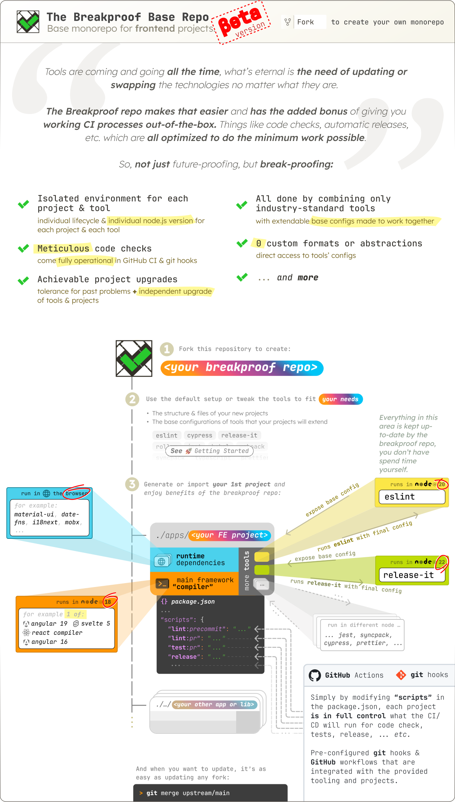

## TLDR-_ish_

1. **❓️What is it**: consider this a template repository but instead of copying
   it, you fork it, and this way you can keep receiving updates simply via `git`

2. **📦️ What's included**: it is monorepo managed only using `pnpm` (_no
   abstraction on top of it_) and it has several packages already in it; each of
   those packages installs only one dependency; this dependency is an
   industry-standard tool like `eslint` or `TypeScript` or `rollup` or `jest`,
   etc. and the package that installs it includes **detailed base
   configuration** for it.

3. **🤔 What's different**: the repo utilizes a lesser known functionality of
   `pnpm` which allows individual packages to choose their own `node.js`
   version; when you combine this with the idea that each existing package
   installs only 1 tool, you essentially get isolated `tool + node.js`, e.g.
   `eslint + node22` which lets you always execute `eslint` using `node22` even
   from other packages via
   `pnpm --filter=<PACKAGE NAME THAT INSTALLS TOOL IN IT> run <TOOL NAME>`

4. **🎯 What's the goal**: you focus on **only on your project code**, not on
   maintaining the tooling around it up-to-date or spending hours/days trying to
   make different tools work well together; the tooling for lint & type checks,
   testing, building, CI/CD, etc. is already working, well configured and
   **always up-to-date**; you get that when you install a package from this repo
   that includes a specific tool and then extend the provided tool config;

5. **🔍 How is this achieved**: your project **can lag behind or have newer
   `node.js` version from any of the tools it uses** and this means you can
   safely upgrade only your project, without having to think about upgrading the
   tools; in fact this repository keeps each individual tool up-to-date, you
   simply pull in the changes in your fork and ✨️*voilà* ✨you are using the
   latest & greatest again.

6. **🎁 CI/CD that just works**: if your projects have specific scripts defined
   in their `package.json`, this repo includes the needed GitHub CI/CD workflows
   & git pre-commit hooks that will pick them up and run them at the correct
   time & place; scripts names are not controversial, so things like `build` for
   building, `test` for testing, `relese` for npm release; some script name
   conventions are not typical but are very explicit, e.g.
   `lint:precommit`/`lint:github-pr` for linting at the given event.

<p> </p>

<picture></picture>

<div align="center">

<a name="breakproof-nav"></a>

💡 [What's the idea?](#the-idea) — 🚀 [Getting started](#getting-started-with-your-breakproof-repo) — 🎯
[Where is this useful?](#purpose) — 🏆 [List of Best Practices](#best-practices-list)

⚙️ [Tools & Configuration](#how-it-works) — ⚖️ [Conventions](#conventions-and-core-principles) — 📋️
[Known TODO](#known-todo-loose-roadmap)

<sub>[How can tools use different node.js?](#but-how-multiple-nodejs)</sub>

</div>

<div align="center">

[](https://github.com/YotpoLtd/breakproof-base-monorepo/fork)
[](https://codespaces.new/YotpoLtd/breakproof-base-monorepo)

</div>

---

<a name="the-idea"></a>

# 💡What's the idea here?

1. 🔀 This is **a repository for frontend projects** and **it's meant to be fork-ed**.

2. ⚡ Once you do that, you have your own
   [monorepo](https://en.wikipedia.org/wiki/Monorepo 'Repository intended for multiple projects') to develop your
   frontend projects in, but **now with**:

   1. [**best-practices** _( listed below ⬇️ )_](#best-practices-list) already **configured** and **operational**.
      (_[see "🚀 Get Started"](#getting-started-with-your-breakproof-repo)_)
   2. each individual tool running in its own isolated version of `nodej.js`, which means **you can upgrade it without
      having to immediately upgrade your project** or vice versa

3. 🌟 When the best practices **_inevitably change_** or tools get outdated, you simply pull updates from this base repo
   into your forked repo, and you will once again be using the latest best practices & newer tools, instead of spending
   time re-reconfiguring them yourself.

4. 🛠️ All the applied best practices are achieved using only
   [**industry-standard tools** _( listed below ⬇️ )_](#tools-list) configured to _work together_.

5. ⚪ There is **_no abstraction wrapping those tools_** or **their configs**, and there is **_nothing that magically
   injects code_** in them.

6. 🧱 This repo provides a [set of conventions](#conventions-and-core-principles) & working base configs for the tools,
   so each individual project can extend & modify them thus remaining in full control of its own configuration.

7. 🔄 Each individual tool can be swapped with another as long as it does it's job.
   _([role of each tool is listed below ⬇️](#tools-list)_

8. 📦 (_this one deserves repetition_): Each individual tool runs in its own isolated environment with its own `nodejs`
   version, which means you can upgrade it without having to immediately upgrade your project or vice versa

To make things easier (_and to serve as example_), there is [code generation](#generators-TODO) that creates new
projects which extend all the base configs.

<p> </p>

[⬆️ Back to top nav ⬆️](#breakproof-nav)

<p> </p>

<a name="purpose"></a>

## 🎯 Where is this useful? (_purpose_)

Using a fork of this repository as the place to develop your projects is useful if any of those fit your setup:

- 🗄 You work in a company with large-enough codebase that you cannot regularly stop development until you upgrade
  everything at once. You need **gradual** isolated **upgrades**.

- 🔍 You have a legacy codebase that you want to gradually bring up to latest standards. You need to be able to split it
  and focus on one piece at time.

- 👨‍🔧 You have a codebase (_of any size_), and you don't want to spend time wiring different tools together just to make
  your software lifecycle work. And then doing the **_same thing again_** when they have new versions. You need those
  processes **already working** and **their upgrades managed** for you.

- 🕊 You want to improve your codebase but cannot fix all problems at once. You need to be tolerant of existing problems
  but forbid new problematic code.

- 🥴 You are tired of learning new configuration formats with each new repo-management tool that comes out and then
  hitting its customization limits. You want to **directly deal with the tools** used.

<p> </p>

[⬆️ Back to top nav ⬆️](#breakproof-nav)

<p> </p>

<a name="getting-started-with-your-breakproof-repo"></a>

# 🚀 Get started with _your_ `breakproof` repo

1. 🔀 **Fork this repo.**

   At this point, you can already try [generating a new project](TODO) and see how tools & CI work out of the box!

2. 🎛️ Tweak the tools in the repo to fit the needs/preferences of your projects:

   - The structure & files of your new projects:
     - [`./.nodejs-versions-whitelist.cjs`](../.nodejs-versions-whitelist.cjs) — Define an array of allowed `node.js`
     - [`./.npm-scopes-whitelist.cjs`](../.npm-scopes-whitelist.cjs) — Define an array of allowed npm scopes
     - [`./infra/build/environment/src/index.ts`](../infra/build/environment/src/index.ts) — Define your target browsers
       here (_as browserlist queries_)
     - [ `./infra/devx-and-repo/generators/_templates/package/new`](../infra/devx-and-repo/generators/_templates/package/new)
       — the templates that `hygen` uses to generate the files of your new projects. versions for your projects, used
       during code generation & code checks (`@scope/<project name>`) for your projects to be used when publishing to
       the npm registry
     - [ `./infra/devx-and-repo/generators/extra-template-vars.ts`](../infra/devx-and-repo/generators/extra-template-vars.ts)
       — some constants that are used during code generation or CLI guides like the text or contact channel you want to 
       output for help
   - The base configurations of tools that your project files extend:
     - [`eslint` base configs](./tools-details.md#eslint-config)
       - take a look at the import-order rule where you should define your own packages' scopes
     - [`release-it` base config](./tools-details.md#release-it-config) & the
       [`conventional-changelog` used by it](./tools-details.md#conventional-changelog-config)
     - [`jest` base config](./tools-details.md#jest-config)
     - [`cypress` base config](./tools-details.md#cypress-config)
     - [`rollup` base config](./tools-details.md#rollup-config)
     - [`babel` base config](./tools-details.md#babel-config)
     - [`webpack` base config](./tools-details.md#webpack-config)
     - [`typescript` base configs](./tools-details.md#typescript-config)
       - special shout out to the `customConditions` in `tsconfig.base.json`, where you can define yours or leave
     - _[...all other secondary tools](#tools-list)_

3. 🙋 Edit `<repo root>/.github/CODEOWNERS` and add your team as owners to the existing paths there

4. 📚 Move `<repo root>/README.md` to `<repo root>/docs/breakproof-repo-base.README.md` (or similar) & create your own
   `<repo root>/README.md`

5. If you haven't already, it's a good time to generate the files for your first project!

## If you want to automatically release projects as `npm` packages

You need to add some GitHub configuration for your repository:

1. Create a
   [`bot`/ `machine` GitHub account](https://docs.github.com/en/site-policy/github-terms/github-terms-of-service#3-account-requirements)
   that will be used **_ONLY_** for the automatic release process. Using email like `bot@<your domain>.com`.

2. Set up GitHub repository `variable`s:

   - `AUTORELEASE_BOT_NAME` – the name to be used as commit author of the automatic version changes to your main branch
   - `AUTORELEASE_BOT_EMAIL` – the email associated bot account you've created; to be used as commit author of the
     automatic version changes to your main branch

3. Set up GitHub repository `secret`s:

   - `AUTORELEASE_BOT_TOKEN`: a GitHub token with rights to push to repository to be used by the bot doing automatic
     releases

4. Set up GitHub Merge Queue:

   - Head to `<your github repo> -> Settings -> Rules -> Rulesets -> New ruleset -> Import a ruleset`
   - And upload `<repo root>/.github/branch-rulesets/Default Branch.json`. This will:

     - Require a `Merge Queue` for your default branch.
     - Require `basics` job from the main GitHub workflow to pass before PRs can be merged

     The above is used to make sure that while the automatic releases runs and might push version bumps & changelogs to
     your default branch, no PR is merged in the meanwhile (which would risk a race condition)

5. Write the steps in `<repo root>/.github/actions/npm-login` that will authenticate you in the `npm` registry.
   - This action is empty by default and gets called on all places where packages are installed
   - To authenticate you would need to configure some repository secrets, depending on your auth approach. All of the
     secrets will be accessible as environment variables, and not through the github `${{ secrets }}`. This is done to
     overcome a limitation in GitHub reusable actions: they can't inherit secrets but do inherit environment variables.
     - `SECRET_NPM_REGISTRY_AUTH_TOKEN` – for this to have a value you must create a secret in your repository settings
       called `NPM_REGISTRY_AUTH_TOKEN`
     - `SECRET_NPM_REGISTRY_USER` – for this to have a value you must create a secret in your repository settings called
       `NPM_REGISTRY_USER`
     - `SECRET_NPM_REGISTRY_PASSWORD` – for this to have a value you must create a secret in your repository settings
       called `NPM_REGISTRY_PASSWORD`

<p> </p>

[⬆️ Back to top nav ⬆️](#breakproof-nav)

<p> </p>

<a name="best-practices-list"></a>

## 🏆 List of Best Practices

|                                                                                                                                                                                                                                                                                                                                                                                                                                                                                                                                                                                                                                                                                                                                                        badge | details                                                                                                                                                                                                                                                   |
| -----------------------------------------------------------------------------------------------------------------------------------------------------------------------------------------------------------------------------------------------------------------------------------------------------------------------------------------------------------------------------------------------------------------------------------------------------------------------------------------------------------------------------------------------------------------------------------------------------------------------------------------------------------------------------------------------------------------------------------------------------------: | :-------------------------------------------------------------------------------------------------------------------------------------------------------------------------------------------------------------------------------------------------------- |
|                                                                                                                                                                                                                                                                                                                                                                                                                                                                                                                                             <picture></picture> | **generate** all required **files for a new project** via interactive CLI step-by-step wizard                                                                                                                                                             |
|                                                                                                                                                                                                                                                                                                                                                                                                                                                                                                                                                   <picture></picture> | each new project **comes with unit, e2e** and **integration tests** enabled                                                                                                                                                                               |
|                                                                                                                                                                                                                                                                                                                                                                                                                                                                                                                                                   <picture></picture> | each new project **comes with typescript support** & **build process** enabled                                                                                                                                                                            |
|                                                                                                                                                                                                                                                                                                                                                                                                                                                                                                                                             <picture></picture> | the **typescript settings are fine-tuned** based on the type of project you chose in the CLI wizard                                                                                                                                                       |
|                                                                                                                                                                                                                                                                                                                                                                                                                                                                                                                                             <picture></picture> | each new project comes with [**_exceptionally extensive_** list of code checks](), individually customizeable for each of your projects                                                                                                                   |
| <picture></picture> | the code checks can **apply possible autofixes** to entire project or only to its files staged for commit                                                                                                                                                 |
|                                                                                                                                                                                                                                                                                                                                                                                                                                                                                                                                                      <picture></picture> | each new project has the ability for **automatic release to `npm` & `GitHub`** when merged in the default branch, following the [conventional commit](`https://www.conventionalcommits.org/en/v1.0.0/)                                                    |
|                                                                                                                                                                                                                                                                                                                                                                                                                                                                                                                                   <picture></picture> | each new project has its individual set of **dependencies completely isolated** from the dependencies of the other projects in the repo                                                                                                                   |
|                                                                                                                                                                                                                                                                                                                                                                                                                                                                                                                                         <picture></picture> | each new **project can choose a different `node.js` version** to use, thus unlock innovation of individual projects                                                                                                                                       |
|                                                                                                                                                                                                   <picture></picture> | all tools that do code checks, tests or release of your project, in fact run in their own **isolated environment with their own `nodejs` version**, which means you can **upgrade them without having to immediately upgrade** your project or vice versa |
|                                                                                                                                                                                                                                                                                                                                                                                                                                                                                                                                              <picture></picture> | **automatically run** some/all of the **code checks & tests on each `GitHub` pull request**, individually customizeable for each of your projects                                                                                                         |
|                                                                                                                                                                                                                                                                                                                                                                                                                                                                                                                                                       <picture></picture> | **automatically run** some/all of the **code checks & tests before `git` commit**, individually customizeable for each of your projects                                                                                                                   |
|                                                                                                                                                             <picture></picture> | detect which projects have been affected by the pull request changes or pending git commits, and run code checks only for them                                                                                                                            |
|                                                                                                                                                                                                                                                                                                                                                                                                                                                                                                                                                 <picture></picture> | announce what is affected by the **pull requests changes** as a GitHub comment                                                                                                                                                                            |
|                                                                                                                                                                                                                                                                                                       <picture></picture> | add **meaningful summary of your GitHub workflows** with the contextual info of what they are running (_GitHub workflow markdown summary_)                                                                                                                |
|                                                                                                                                                                                                                                                                                                                                                                                                                                                                                                                                            <picture></picture> | ability to **modify existing projects**, so you can make them release-able or add code-checks, all done **via a CLI step-by-step wizard**                                                                                                                 |
|                                                                                                                                                                                                                                                                                                                                                                                                                                                                                                                                               <picture></picture> | **shared `npm` scripts** listed in a single place and can be **used by any of your packages** to help you analyze problems with it                                                                                                                        |
|                                                                                                                                                                                                                                   <picture></picture> | conventions to be followed by each package for more **unified development experience**                                                                                                                                                                    |
|                                                                                                                                                                                                                                                                                                                                                                                                                                                                                                                                                 <picture></picture> | **instructions** and importable configuration **for your code editor** to get the best developer experience possible when developing your projects                                                                                                        |
|                                                                                                                                                                                                                                                                                                                                                                                                                                                                                                                             <picture></picture> | **instructions** on how to **configure your GitHub repository** to prevent problems and work best with the breakproof base                                                                                                                                |

<p> </p>

[⬆️ Back to top nav ⬆️](#breakproof-nav)

<p> </p>

<a name="how-it-works"></a>

# ⚙️ How the repo works

**What you see is what you get**:

- Installation of industry-standard tools
- Base configs of those tools, which are created to work well together
- Code-generation tool that creates your new project with ~empty config files that extend the base ones.
- Your projects can directly add/override specific config parts or optionally use available helpers to do so
- Since your project simply extends the config, you can modify it to fit your package individual needs without learning
  new config formats specific to this repo – _**you directly use the configs of each tool**_.
- Each tool runs in isolated environment with its individual version of `nodejs`
  (_[see ❓ How can tools use different node.js ❓](#but-how-multiple-nodejs)_)

<a name="tools-list"></a>

## 🧰 The current list of tools configured to work together

Nothing is perfect, so this list will inevitably change
(_[see ⬇️ "Known TODO/loose roadmap"](#known-todo-loose-roadmap)_). Here are the currently used tools:

| Tool                                                                                                                                               | What it's used for                                                  | Provided Configuration                                                         | `node.js` version used                       |
| :------------------------------------------------------------------------------------------------------------------------------------------------- | :------------------------------------------------------------------ | :----------------------------------------------------------------------------- | :------------------------------------------- |
| [🌐](https://pnpm.io/) `pnpm`                                                                                                                      | [🧩 multiple roles](./tools-details.md#pnpm-role)                   | [⚙️ forkable config in repo](./tools-details.md#pnpm-config)                   | n/a _(does not rely on available `node.js`)_ |
| [🌐](https://www.gnu.org/software/bash/) `bash` functions & scripts                                                                                | [🧩 multiple roles](./tools-details.md#bash-role)                   | 🕳️ no config applied in repo                                                   | n/a _(does not rely on `node.js`)_           |
| [🌐](https://www.shellcheck.net/) `shell-check`                                                                                                    | [🧩 multiple roles](./tools-details.md#shell-check-role)            | 🕳️ no config applied in repo                                                   | n/a _(does not rely on `node.js`)_           |
| [🌐](https://eslint.org/) `eslint` + plugins                                                                                                       | [🧩 multiple roles](./tools-details.md#eslint-role)                 | [⚙️ base config in repo](./tools-details.md#eslint-config)                     | `v22.6.0`                                    |
| [🌐](https://prettier.io/) `prettier`                                                                                                              | [🧩 multiple roles](./tools-details.md#prettier-role)               | [⚙️ base config in repo](./tools-details.md#prettier-config)                   | `v22.6.0`                                    |
| [🌐](https://www.typescriptlang.org/) `typescript`                                                                                                 | [🧩 multiple roles](./tools-details.md#typescript-role)             | [⚙️ base config in repo](./tools-details.md#typescript-config)                 | `<same as your package>` or `v22.6.0`        |
| [🌐](https://sucrase.io/) `sucrase`, [🌐](https://typestrong.org/ts-node/) `ts-node` & [🌐](https://github.com/privatenumber/tsx) `tsx`            | [🧩 multiple roles](./tools-details.md#sucrase-tsnode-tsx-role)     | [⚙️ base config in repo](./tools-details.md#sucrase-tsnode-tsx-config)         | `<same as your package>` or `v22.6.0`        |
| [🌐](https://rhysd.github.io/actionlint/) `actionlint`                                                                                             | [🧩 multiple roles](./tools-details.md#actionlint-role)             | 🕳️ no config applied in repo                                                   | n/a _(does not rely on `node.js`)_           |
| [🌐](https://github.com/lint-staged/lint-staged) `lint-staged`                                                                                     | [🧩 multiple roles](./tools-details.md#lint-staged-role)            | [⚙️ base config in repo](./tools-details.md#lint-staged-config)                | `v22.6.0`                                    |
| [🌐](https://github.com/acrazing/dpdm#readme) `dpdm`                                                                                               | [🧩 multiple roles](./tools-details.md#dpdm-role)                   | [⚙️ base config in repo](./tools-details.md#dpdm-config)                       | `v22.6.0`                                    |
| [🌐](https://github.com/depcheck/depcheck#readme) `depcheck`                                                                                       | [🧩 multiple roles](./tools-details.md#depcheck-role)               | [⚙️ base config in repo](./tools-details.md#depcheck-config)                   | `v22.6.0`                                    |
| [🌐](https://github.com/runem/lit-analyzer#readme) `lit-analyzer`                                                                                  | [🧩 multiple roles](./tools-details.md#lit-analyzer-role)           | [⚙️ base config in repo](./tools-details.md#lit-analyzer-config)               | `v22.6.0`                                    |
| [🌐](https://jamiemason.github.io/syncpack/) `syncpack`                                                                                            | [🧩 multiple roles](./tools-details.md#syncpack-role)               | [⚙️ forkable config in repo](./tools-details.md#syncpack-config)               | `v22.6.0`                                    |
| [🌐](https://www.cypress.io/) `cypress`                                                                                                            | [🧩 multiple roles](./tools-details.md#cypress-role)                | [⚙️ base config in repo](./tools-details.md#cypress-config)                    | `v22.6.0`                                    |
| [🌐](https://jestjs.io/) `jest`                                                                                                                    | [🧩 multiple roles](./tools-details.md#jest-role)                   | [⚙️ base config in repo](./tools-details.md#jest-config)                       | `v22.6.0`                                    |
| [🌐](https://github.com/conventional-changelog/conventional-changelog/tree/master/packages/conventional-changelog#readme) `conventional-changelog` | [🧩 multiple roles](./tools-details.md#conventional-changelog-role) | [⚙️ base config in repo](./tools-details.md#conventional-changelog-config)     | `v22.6.0`                                    |
| [🌐](https://github.com/release-it/release-it?tab=readme-ov-file#release-it-) `release-it`                                                         | [🧩 multiple roles](./tools-details.md#release-it-role)             | [⚙️ base config in repo](./tools-details.md#release-it-config)                 | `v22.6.0`                                    |
| [🌐](https://webpack.js.org/) `webpack`                                                                                                            | [🧩 multiple roles](./tools-details.md#webpack-role)                | [⚙️ base config in repo](./tools-details.md#webpack-config)                    | `<same as your package>` or `v22.6.0`        |
| [🌐](https://rollupjs.org/) `rollup` + plugins                                                                                                     | [🧩 multiple roles](./tools-details.md#rollup-role)                 | [⚙️ base config in repo](./tools-details.md#rollup-config)                     | `<same as your package>` or `v22.6.0`        |
| [🌐](https://babel.dev/) `babel` + plugins                                                                                                         | [🧩 multiple roles](./tools-details.md#babel-role)                  | [⚙️ base config in repo](./tools-details.md#babel-config)                      | `<same as your package>` or `v22.6.0`        |
| [🌐](https://www.hygen.io/) `hygen`                                                                                                                | [🧩 multiple roles](./tools-details.md#hygen-role)                  | [⚙️ forkable config in repo](./tools-details.md#hygen-config)                  | `v22.6.0`                                    |
| [🌐](https://git-scm.com/) `git` hooks                                                                                                             | [🧩 multiple roles](./tools-details.md#git-hooks-role)              | [⚙️ forkable config in repo](./tools-details.md#git-hooks-config)              | n/a _(does not rely on `node.js`)_           |
| [🌐](https://github.com/features/actions) `github` CI                                                                                              | [🧩 multiple roles](./tools-details.md#github-ci-role)              | [⚙️ forkable config in repo](./tools-details.md#github-ci-config)              | n/a _(does not rely on `node.js`)_           |
| [🌐](https://code.visualstudio.com/) `VSCode` calibration                                                                                          | [🧩 multiple roles](./tools-details.md#vscode-calibration-role)     | [⚙️ hint + importable config](./tools-details.md#vscode-calibration-config)    | `v22.6.0` (_editor itself uses that_)        |
| [🌐](https://www.jetbrains.com/) `JetBrains` calibration                                                                                           | [🧩 multiple roles](./tools-details.md#jetbrains-calibration-role)  | [⚙️ hint + importable config](./tools-details.md#jetbrains-calibration-config) | `v22.6.0` (_editor itself uses that_)        |

<p> </p>

[⬆️ Back to top nav ⬆️](#breakproof-nav)

<p> </p>

<a name="but-how-multiple-nodejs"></a>

## ❓ How can tools use different node.js? ❓

1. 💡 **There's no magic!** `The Breakproof Repo` takes advantage of the 2 simple ideas:

   1. in a monorepo, everything can be an individual package
   2. industry-standard tools like `pnpm` can define package-specific behaviour

1. 📦 So in a monorepo, **each of your projects are individual packages**. In the same way, it's possible to create a
   package inside the repository that **only installs 1 tool and nothing else**.

1. ↪️ Instead of installing the tools directly, your projects install the other packages from the repo that isolate the
   tool they need inside of them. **In other words**:

   - If you need `eslint`, instead of running `pnpm install eslint --save-dev`, your project will do
     `pnpm install @repo/eslint-base-isolated --save-dev`
   - And instead of running `npx eslint`, your project will do `pnpm --filter="@repo/eslint-base-isolated" run eslint`
     which means they run the `eslint` script defined in the `package.json` of the `<tool name>-base-isolated` package
   - The existence of `@repo/eslint-base-isolated` as individual package allow us to define that all of its scripts
     (_including the `eslint`_ one) are executed using a specific version of node. For this to happen we currently rely
     on `pnpm` (_[the roles of pnpm in this repo are listed below ⬇️](#pnpm-role)_)
   - Finally, the `eslint` script simply needs to enter your project directory (a.k.a. `cd <project dir>`) and run
     `eslint`.

**Related:**

- In reality, it's very unlikely that you ever run `pnpm --filter="@repo/evergreen-eslint-isolator" run eslint`
  yourself, because the base configuration files and code generators in this repo already know about the packages that
  isolate tools and use them.
- The name of the package `@repo/evergreen-eslint-isolator` is an example, so practically it can be called anything

<p> </p>

[⬆️ Back to top nav ⬆️](#breakproof-nav)

<p> </p>

<a name="conventions-and-core-principles"></a>

# ⚖️ Repository conventions & core principles

- Avoid adding abstractions to the already overloaded frontend world
- People should be aware of what comes with their dependencies
- Each package must declare the `node.js` version used for running the `scripts` its `package.json`
  - mandatory eslint code check for this runs on git precommit & GitHub PR
- Packages are allowed to pick `node.js` version from a white-list to avoid extreme fragmentation of versions
  - mandatory eslint code check for this runs on git precommit & GitHub PR
- Each package must have a script called `lint:precommit` which would run as git hook before commits and execute
  preferred code checks
  - mandatory eslint code check for this runs on git precommit
- Each package must have a script called `lint:github-pr` which would run on each push to a GitHub PR and execute
  preferred code checks
  - mandatory eslint code check for this runs on GitHub PR
- Each package that requires a build step must have scripts called `build` and `dev` which are used to verify build
  passes and run before building other packages that depend on them
  - If the package is an app, the `dev` script can also be named `serve` to match popular conventions
- Each package that should be published to `npm` registry must have s script called `release` and whatever is executed
  must accept arguments compatible with `release-it` CLI
- Following what each configuration extends and understanding why it's configured this way should be easy
- Writing configurations files should provide hints for available options without having to jump to documentation every
  time
  - Prefer `.ts` config over `.js`, `.cjs`, `.mjs` or `.json` config. We get type checks + ability to comment.
  - Prefer `.mjs` config with jsdoc over `.js`, `.cjs`, or `.json` config. We get type hints + ability to comment.
  - Prefer `.cjs` or `.js` config with jsdoc over `.json` config. We get type hints + ability to comment.
- Configurations can have different variations (e.g. "dev" vs "production" mode) and preferably they are defined in a
  single file without repeating different options for each mode
- When using `CLI` commands prefer `--longer` argument names over shorter versions like `-l`
- Code editors are first-class runtime environments we need to care about
  - postinstall script that guarantees code editors see `eslint` and `prettier` but CI doesn't do this extra step
- Build-caching should be thought as a separate layer that can be added later, not requirement from the start

<p> </p>

[⬆️ Back to top nav ⬆️](#breakproof-nav)

<p> </p>

<a name="known-todo-loose-roadmap"></a>

# 📋️ Known TODO / Loose Roadmap

**====== !!!! WIP !!!!! ======**

- When projects within `./infra/code-checks/*` change -> run lint for all packages that depend on them
  - Can be achieved by an additional script in their `"test:github-pr"`
    - This means `lint-stage-isolated` must depend on things like `eslint-problem-snapshotter` but that creates a
      circular dependency
      - OR simply to install `eslint-problem-snapshotter` to each package that uses the default lint base (which is all
        packages )
        - but that again won't work for `lint-stage-isolated`
        - or `code-problem-snapshotter`
  - Another simple way: run lint checks for all packages if a package under `./infra/code-checks/*` changed?
- Ask for `projectId` when creating e2e app
- Ask for CYPRESS SECRET NAME WHEN CREATING e2e APP
- CODEOWNERS
  - validate all files have code owners
- Unify/standartize naming
  - `tsconfig-bases` -> `typescript-isolated-base`
  - `[?unsure?]` consider isolated package for `prettier` — is it really useful since we always link it to the
    `prettier eslint plugin` which is linked to `eslint` itself?
- Configuration that is not related to a tool directly:
  - supported browsers: it can be exposed to some empty file, less likely to conflict
  - sentence for generators to prompt for help
  - link for the generators to point you for help
  - allowed npm scopes
  - allowed node versions
- CODEOWNERS
  - Ask for team name and add them to CODEOWNERS after package generation
- Enable eslint plugin that uses schema to check `angular.json` files
- Have a generator for Angular app and lib
- Document repo requires "No squash" methodology so keep commits clear
- Base `tsconfig` for `lit`-based projects.
- Repo-level check for subsequent commits with the same message and forbid this one.
- Document when to use pnpm patch and when not to and when this repository is using it already
- Generate empty README.md and validate that something is actually added by developer
- Document existing packages and 1-line description
- CI job that runs `eslint` instead of `eslint-snapshotter` and comments on each PR that some of the (affected/repo?)
  packages have eslint problems they have "ignored"
- Add test for code generators which:
  - generate a new lib package
    - run its build & test
    - run its sandbox recursive build
  - generate release-able lib package and test that it's included in the list of upcoming versions
  - generate app package, run build & test
- Make script for the `e2e` apps that can build the app it depends on and then start a http server from its `dist`
  directory
- Create `esbuild/vite/rollup-isolator-env` package to host webpack & `evergreen-esbuuld/vite/rollup-lib-builder` that
  can be used by any app/lib that doesn't require its own build or CLI system (like `angular`, or `svelte-kit`)
  - With this the lib will only have browser-related dependencies which means its `node.js` will no longer be relevant
- Create `webpack-isolator-env` package to host webpack & `evergreen-webpack-builder` that can be used by any app/lib
  that doesn't require its own build or CLI system (like `angular`, or `svelte-kit`)
  - With this the app/lib will only have browser-related dependencies which means its `node.js` will no longer be
    relevant
- Make `dev:with-deps` only run direct specific dependencies or add a new script that does that
- Shared `--workspace-root` script to be used as an easy way to snapshot all current eslint errors
- Shared `--workspace-root` script to be used as an easy way to snapshot all current TypeScript errors
- Add `lit-analyzer` in base `lint-staged` config
- Document merge queue settings for GitHub that will prevent merging of PRs while automatic releases are happening
- Lint script to forbid googlefonts references, same for fullstory
- Create a mandatory code check via eslint to verify that there are no missing or mismatched peer depenencies OR each of
  the problems are intentionally ignored by providing a reason. Use a `.ts` config file for defining ignored problems.
  - Provide base config for known ignored problems
- Create a mandatory code check that verifies that dependencies declared as optional are really optional.
- Consider splitting `dependencies`, `devDependencies` and `optionalDependencies` into even more, purpose-specific
  sections like:

  - App deps
  - Peer deps required by runtime
  - Release
  - Release peer
  - Test
  - Test peer
  - Build
  - Build peer
  - Deprecated/legacy runtime
  - DeprecatedPeer

- Shared script to list all \*-isolated packages

  Notes:

  - `pnpm prune --no-optional`
  - then try to build

  ```shell
  ########################## Some notes for commands that we can execute for code checks ##########################
  # FOR THE following commands we need to remove pnpm.patchedDependencies from package.json
  jq 'del(.pnpm.patchedDependencies)' package.json > package.json.tmp && mv package.json.tmp package.json
  # if there are package json changes validate that peer deps of the changed packages are correct
  # ref: https://github.com/pnpm/pnpm/issues/6893#issuecomment-1944828397
  pnpm install --filter="[HEAD]..." install --resolution-only
  # if there are changes in lock file, validate peer deps are correct for ALL packages
  pnpm install --filter="*" install --resolution-only
  ```

- Create a mandatory code check via eslint to verify that `tsconfig*json` files do not define `types` or `typeRoots`.
  - executed via eslint plugin for json schema
  - custom error message: "Instead `type`/`typeRoots` create a `.d.ts` file that you add to the `include` section of
    your config. This is done so that base `tsconfig` can use `type`/`typeRoots` since they can't use `include`"
- If there is a use-case for `"composite": true` in `tsconfig*json` files, always define `"tsBuildInfoFile"` to
  something like `"./node_modules/.cache/tsconfig.node.tsbuildinfo"`
- FORBID major version changes for packages that are directly used via the `workspace:` version
- Add extra config to the existing eslint rule for package.json and make sure `packageExtensions` section in the root
  `package.json5` is sorted alphabetically
- Add extra config to the existing eslint rule for package.json and make sure `codeEditorIntegrationDependencies`
  section in the root `package.json5` is sorted alphabetically
- Create a wrapper package around url handling in React
- Create a @repo/tscore package

**====== !!!! WIP !!!!! ======**

<p> </p>

[⬆️ Back to top nav ⬆️](#breakproof-nav)

<p> </p>

# Yotpo specifics

**====== !!!! WIP !!!!! ======**

- We have 2 packages providing base config for `eslint` and `prettier`. One (`@repo/eslint-base-isolated`) depends on
  the other (`@yotpo-common/shared-linter-config`). We've done this since we still have projects in their own separate
  repos and we want to expose eslint config for them but still have specific for this repo tweaks.

**====== !!!! WIP !!!!! ======**

### What's with

`[ -n \"$(pwd | grep '/node_modules/')\" ] || echo $npm_config_user_agent | grep -q 'pnpm/' || (echo 'PLEASE USE PNPM, not NPM' && exit 1)`?

We want to disallow package managers other than `pnpm` to be used in this repo. So we add this script to every package
`preinstall` hook.

Ideally it would be just `npx only-allow pnpm` as described in [pnpm docs](https://pnpm.io/only-allow-pnpm), but:

1. [There is a bug](https://github.com/pnpm/only-allow/pull/14) in `only-allow` so we work around it.
1. If developer is only using `pnpm` they might not have `node` installed at all, so we need to check if `npx` exists
   (_via `which npx`_)
